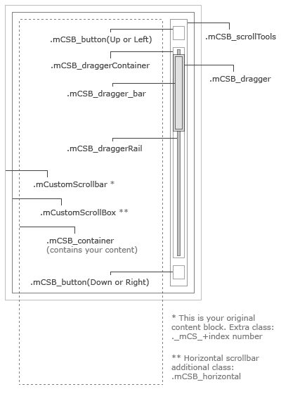

该例子用到的代码都在index.html中，以下为一些滚动条的设置参数

---

set_width:false | 设置你内容的宽度 值可以是像素或者百分比

set_height:false | 设置你内容的高度 值可以是像素或者百分比

horizontalScroll:Boolean | 是否创建一个水平滚动条 默认是垂直滚动条 值可为:true(创建水平滚动条) 或 false

scrollInertia:Integer | 滚动的惯性值 在毫秒中 使用0可以无滚动惯性 (滚动惯性可以使区块滚动更加平滑)

scrollEasing:String | 滚动动作类型

mouseWheel:String/Boolean | 鼠标滚动的支持 值为:true.false,像素 默认的情况下 鼠标滚动设置成像素值 填写false取消鼠标滚动功能

mouseWheelPixels:Integer | 鼠标滚动中滚动的像素数目 值为以像素为单位的数值

autoDraggerLength:Boolean | 根据内容区域自动调整滚动条拖块的长度 值:true,false

scrollButtons:{   enable:Boolean  } | 是否添加 滚动条两端按钮支持 值:true,false

scrollButtons:{   scrollType:String  } | 滚动按钮滚动类型 值:”continuous”(当你点击滚动控制按钮时断断续续滚动)  “pixels”(根据每次点击的像素数来滚动)

scrollButtons:{   scrollSpeed:Integer  } | 设置点击滚动按钮时候的滚动速度(默认 20) 设置一个更高的数值可以更快的滚动

scrollButtons:{   scrollAmount:Integer   } | 设置点击滚动按钮时候每次滚动的数值 像素单位 默认 40像素

advanced:{   updateOnBrowserResize:Boolean  } | 根据百分比为自适应布局 调整浏览器上滚动条的大小 值:true,false 设置 false 如果你的内容块已经被固定大小

advanced:{   updateOnContentResize:Boolean   } |
自动根据动态变换的内容调整滚动条的大小 值:true,false 设置成 true 将会不断的检查内容的长度并且据此改变滚动条大小
建议除非必要不要设置成 true 如果页面中有很多滚动条的时候 它有可能会产生额外的移出 你可以使用 update 方法来替代这个功能

advanced:{   autoExpandHorizontalScroll:Boolean   } | 自动扩大水平滚动条的长度 值:true,false 设置 true 你可以根据内容的动态变化自动调整大小

advanced:{   autoScrollOnFocus:Boolean   } | 是否自动滚动到聚焦中的对象 例如表单使用类似TAB键那样跳转焦点 值:true false

callbacks:{   onScrollStart:function(){}   } | 使用自定义的回调函数在滚动时间开始的时候执行

callbacks:{   onScroll:function(){}   } | 自定义回调函数在滚动中执行 Demo 同上

callbacks:{   onTotalScroll:function(){}  } | 当滚动到底部的时候调用这个自定义回调函数 Demo 同上

callbacks:{   onTotalScrollBack:function(){}   } | 当滚动到顶部的时候调用这个自定义回调函数 Demo 同上

callbacks:{   onTotalScrollOffset:Integer   } | 设置到达顶部或者底部的偏移量 像素单位

callbacks:{  whileScrolling:function(){}  } | 当用户正在滚动的时候执行这个自定义回调函数

callbacks:{  whileScrollingInterval:Integer  } | 设置调用 whileScrolling 回调函数的时间间隔 毫秒单位

1、update

用法：$(selector).mCustomScrollbar(“update”);

调用 mCustomScrollbar 函数的 update 方法去实时更新滚动条当内容发生变化（例如 通过 Javascript 增加或者移除一个对象、通过 ajax 插入一段新内容、隐藏或者显示一个新内容等）

2、scrollTo

用法：$(selector).mCustomScrollbar(“scrollTo”,position);

你可以使用这个方法自动的滚动到你想要滚动到的位置。这个位置可以使用字符串（例如 “#element-id”，“bottom” 等）描述或者是一个数值（像素单位）。下面的例子将会滚动到最下面的对象

scrollTo 方法的参数

$(selector).mCustomScrollbar(“scrollTo”,String); | 滚动到某个对象的位置，字符串型的值可以是 id 或者 class 的名字

$(selector).mCustomScrollbar(“scrollTo”,”top”); | 滚动到顶部（垂直滚动条）

$(selector).mCustomScrollbar(“scrollTo”,”bottom”); | 滚动到底部（垂直滚动条）

$(selector).mCustomScrollbar(“scrollTo”,”left”); | 滚动到最左边（水平滚动条）

$(selector).mCustomScrollbar(“scrollTo”,”right”); | 滚动到最右边（水平滚动条

$(selector).mCustomScrollbar(“scrollTo”,”first”); | 滚动到内容区域中的第一个对象位置

$(selector).mCustomScrollbar(“scrollTo”,”last”); | 滚动到内容区域中的最后一个对象位置

$(selector).mCustomScrollbar(“scrollTo”,Integer); | 滚动到某个位置（像素单位）

scrollTo 方法还有两个额外的选项参数

moveDragger: Boolean | 滚动滚动条的滑块到某个位置像素单位，值：true，flase。例如：$(selector).mCustomScrollbar(“scrollTo”,200,{ moveDragger:true });

callback：Boolean | 执行回调函数当 scroll-to 完成之后，值：true，false 例如：$(selector).mCustomScrollbar(“scrollTo”,200,{ callback:true });

3、disable

用法：$(selector).mCustomScrollbar(“disable”);

调用 disable 方法去使滚动条不可用。如果想使其重新可用，调用 update方法。disable 方法使用一个可选参数（默认 false）你可以设置 true 如果你想重新让内容区域滚动当 scrollbar 不可用时。例如：

4、distroy

用法：$(selector).mCustomScrollbar(“destroy”);

调用 destroy 方法可以移除某个对象的自定义滚动条并且恢复默认样式

我们可以这样来设置，如下代码：

.mCSB_1_scrollbar .mCSB_dragger .mCSB_dragger_bar{

    /* 1st scrollbar dragger style… */

}

.mCSB_2_scrollbar .mCSB_dragger .mCSB_dragger_bar{

    /* 2nd scrollbar dragger style… */

}

.mCSB_3_scrollbar .mCSB_dragger .mCSB_dragger_bar{

    /* 3rd scrollbar dragger style… */

}

我们还可以看下关于滚动条的图解，相信会更加清晰，如下：



你可以通过调用mCustomScrollbar回调选项参数来触发你自己的js函数

```
$(".content").mCustomScrollbar({

    callbacks:{

        onScroll:function(){

            myCustomFn(this);

        }

    }

});


function myCustomFn(el){

    console.log(el.mcs.top);

}
```

在上面的例子中，每个滚动事件结束的时间和内容已经停止滚动，内容顶部将被记录在浏览器的控制台。对于每个滚动事件都有对应的回调函数，如下：

 onScrollStart -触发滚动事件开始的那一刻

 whileScrolling -当滚动事件被触发运行

 onScroll -触发滚动事件完成时

 onTotalScroll -触发时，内容已经滚动一路向下或向右

 onTotalScrollBack -触发时，内容已经滚动或离开所有的方式回到顶部

您可以通过分别设置onTotalScrollOffset和onTotalScrollBackOffset，为onTotalScroll和onTotalScrollBack设置一个偏移值（像素）。例如，下面将触发回调函数，当内容已滚动至底部时减去100像素

```
$(".content").mCustomScrollbar({

    callbacks:{

        onTotalScroll:function(){

            console.log("scrolled to bottom");

        },

    onTotalScrollOffset:100

    }

});
```
该脚本返回一个数字值和对象相关的滚动条


this – 包含滚动条的原始元素（S）

this.mcs.content – 原始内容包装为jQuery对象

this.mcs.top – 内容的顶部位置（像素）

this.mcs.left – 内容的左侧位置（像素）

this.mcs.draggerTop – 滚动牵引机的顶部位置（像素）

this.mcs.draggerLeft – 滚动条牵引机的左侧位置（像素）

this.mcs.topPct – 内容垂直滚动的百分比

this.mcs.leftPct – 内容水平滚动的百分比

this.mcs.direction – 内容的滚动方向（Y或X）

```
$("#content_1").mCustomScrollbar({

    callbacks:{

        whileScrolling:function(){

            myCustomFn(this);

        }

    }

});


function myCustomFn(el){

    var msg="Content inside the element with id '"+el.attr("id")+"' has scrolled "+mcs.topPct+"%";

  console.log(msg);

}
```


